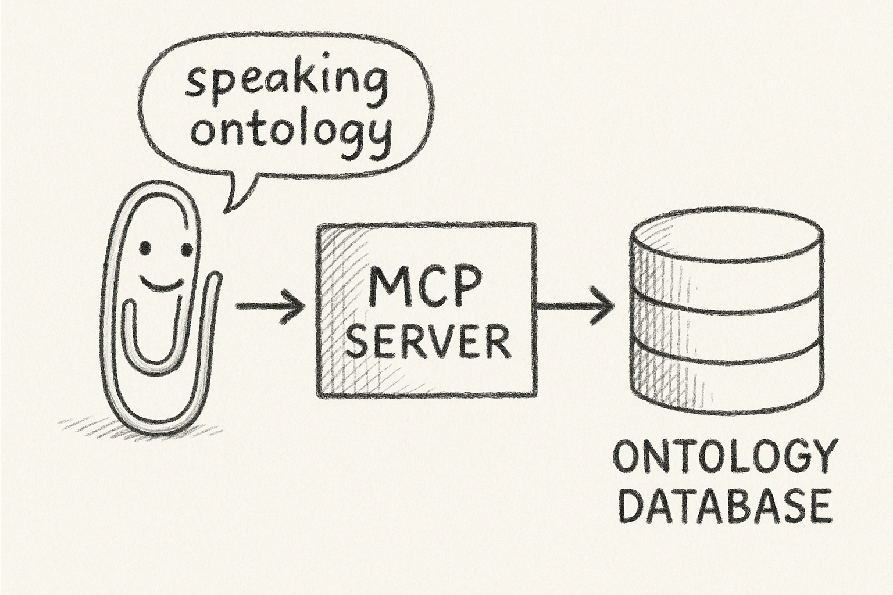
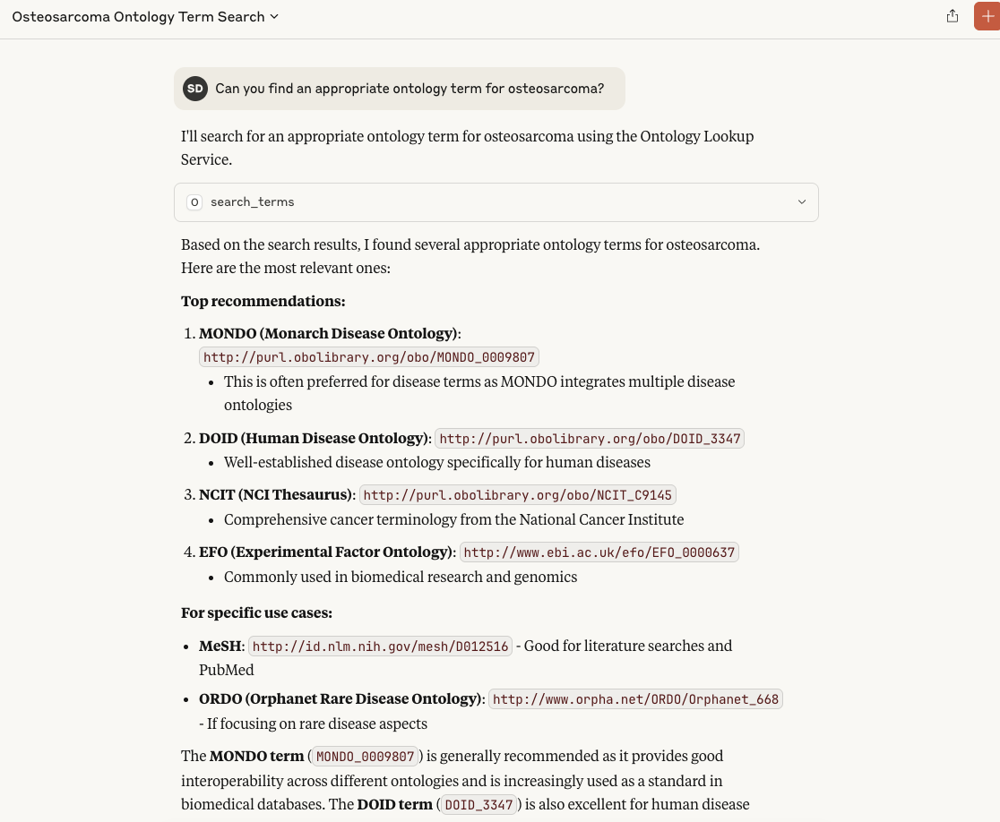

# OLS MCP Server

Large Language Models are notoriously bad at working with ontologies, often hallucinating terms or their identifiers. This server provides a reliable way to access and query ontologies, ensuring accurate and up-to-date information.



This repository contains a Model Context Protocol (MCP) server providing access to the [Ontology Lookup Service (OLS)](https://www.ebi.ac.uk/ols4/) API. This server enables AI assistants to search for and retrieve ontological terms, concepts, and hierarchies from various biological and medical ontologies.

This server is designed to work seamlessly with AI assistants like Claude Desktop, allowing users to query ontologies using natural language. It supports a wide range of ontologies, including Gene Ontology (GO), Human Phenotype Ontology (HP), and many others. 



## Features

The OLS MCP Server provides the following tools:

- **🔍 Search Terms**: Search for terms across ontologies with flexible filtering
- **📚 Search Ontologies**: Discover available ontologies and their metadata
- **ℹ️ Get Ontology Information**: Retrieve detailed information about specific ontologies
- **🎯 Get Term Information**: Get comprehensive details about specific terms
- **🌳 Get Term Children**: Find direct child terms in ontological hierarchies
- **👨‍👩‍👧‍👦 Get Term Ancestors**: Retrieve parent terms and ancestors
- **🤖 Find Similar Terms**: Discover semantically similar terms using LLM embeddings

## Supported Ontologies

The server works with any ontology available through the EBI Ontology Lookup Service, including:

- **GO** (Gene Ontology)
- **EFO** (Experimental Factor Ontology)
- **HP** (Human Phenotype Ontology)
- **MONDO** (Monarch Disease Ontology)
- **ChEBI** (Chemical Entities of Biological Interest)
- **UBERON** (Uber-anatomy ontology)
- And many more...

## Installation

### Prerequisites

- Python 3.12 or higher
- [uv](https://docs.astral.sh/uv/) package manager

### Install uv (if not already installed)

```bash
# macOS/Linux
curl -LsSf https://astral.sh/uv/install.sh | sh

# Windows
powershell -c "irm https://astral.sh/uv/install.ps1 | iex"
```

### Install the OLS MCP Server

```bash
# Clone the repository
git clone <repository-url>
cd ols-mcp-server

# Install dependencies
uv sync

# Install as a tool (optional)
uv tool install .
```

## Configuration

### Claude Desktop Configuration

To use this server with Claude Desktop, add the following configuration to your Claude Desktop config file:

**macOS**: `~/Library/Application Support/Claude/claude_desktop_config.json`
**Windows**: `%APPDATA%\Claude\claude_desktop_config.json`

```json
{
  "mcpServers": {
    "ols-mcp-server": {
      "command": "uv",
      "args": [
        "tool",
        "run",
        "ols-mcp-server"
      ],
      "env": {}
    }
  }
}
```

### Alternative Configuration (if installed as tool)

If you installed the server as a uv tool, you can use this simpler configuration:

```json
{
  "mcpServers": {
    "ols-mcp-server": {
      "command": "ols-mcp-server",
      "args": [],
      "env": {}
    }
  }
}
```

### Development Configuration

For development with debug logging:

```json
{
  "mcpServers": {
    "ols-mcp-server": {
      "command": "uv",
      "args": [
        "run",
        "python",
        "-m",
        "ols_mcp_server.server",
        "--debug"
      ],
      "env": {},
      "cwd": "/path/to/ols-mcp-server"
    }
  }
}
```

## Usage Examples

Once configured with Claude Desktop, you can use natural language to interact with the OLS API:

### Searching for Terms

> "Search for terms related to diabetes in the Human Phenotype Ontology"

> "Find all terms containing 'apoptosis' in the Gene Ontology"

### Getting Ontology Information

> "Tell me about the Gene Ontology"

> "What ontologies are available for chemical compounds?"

### Exploring Term Hierarchies

> "Show me the children of the term 'metabolic process' in GO"

> "What are the ancestor terms for HP:0000118?"

### Finding Similar Terms

> "Find terms similar to 'heart development' in the Gene Ontology"

## Development Setup

### Setting up the Development Environment

1. **Clone the repository**:
   ```bash
   git clone <repository-url>
   cd ols-mcp-server
   ```

2. **Install dependencies**:
   ```bash
   uv sync --extra dev
   ```

3. **Activate the virtual environment**:
   ```bash
   source .venv/bin/activate  # macOS/Linux
   # or
   .venv\Scripts\activate     # Windows
   ```


### Code Quality

```bash
# Format code
uv run ruff format

# Lint code
uv run ruff check

# Type checking
uv run mypy src/
```


### Adding New Features

1. **Add new tools** in `src/ols_mcp_server/server.py` using the `@mcp.tool()` decorator
2. **Create models** in `src/ols_mcp_server/models.py` for structured responses
3. **Update tests** to cover new functionality
4. **Update documentation** as needed

### API Documentation

The server interacts with the EBI Ontology Lookup Service API v2. Key endpoints:

- **Search**: `https://www.ebi.ac.uk/ols4/api/search`
- **Ontologies**: `https://www.ebi.ac.uk/ols4/api/v2/ontologies`
- **Terms**: `https://www.ebi.ac.uk/ols4/api/terms`
- **Hierarchies**: `https://www.ebi.ac.uk/ols4/api/v2/ontologies/{ontology}/classes/{term}/children`

## Troubleshooting

### Common Issues

1. **Server not found**: Ensure the path to the server is correct in your Claude config
2. **Permission errors**: Make sure the server script is executable
3. **Network errors**: Check your internet connection and firewall settings
4. **Python version**: Ensure you're using Python 3.12 or higher


## Contributing

1. Fork the repository
2. Create a feature branch: `git checkout -b feature-name`
3. Make your changes
4. Run tests: `uv run pytest`
5. Format code: `uv run ruff format`
6. Submit a pull request
]

## Acknowledgments

- [EBI Ontology Lookup Service](https://www.ebi.ac.uk/ols4/) for providing the API
- [FastMCP](https://github.com/jlowin/fastmcp) for the MCP framework
- The ontology communities for maintaining these valuable resources
